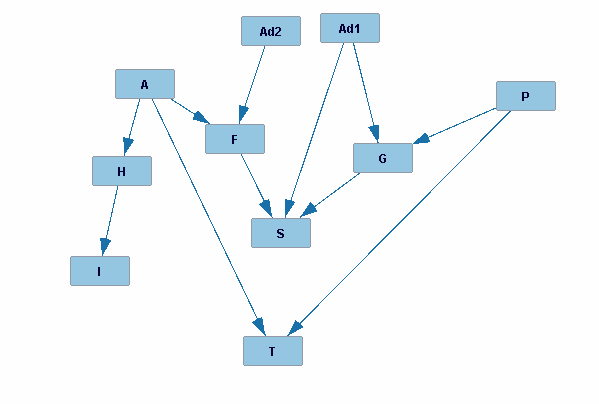

## Bayesian Network Modeling
1. 
2. Structure discovery algorithms might be able to orient the direction of some edges, but not others because some nodes, like A, H, and I, in our example, can be oriented in different ways while maintaining the same independence relationships.

 
 

## PGM Programming

2a.
P(W)
| W | P(W) |
| ------- | ------- |
| W(0) |   0.3013 |
| W(1) |   0.6987 |

2b.
P(W | X=1)
| X | P(X) |
| ------- | ------- |
| X(0) |   0.3963 |
| X(1) |   0.6037 |

2c.
P(Z | W=0, do(X=0))
| Z | P(Z) |
| ------- | ------- |
| Z(0) |   0.2615 |
| Z(1) |   0.7385 |

 
 

## Problem 7:
 
1. 20.779393798843557
 
2. 0
 
3. {'I': 1, 'P': 1, 'F': 0, 'G': 1, 'T': 1, 'S': 0, 'A': 0, 'H': 1}

 
 

## Problem 8:
 
1a. Since our VPI is close to 21, our expected utility increases by 21 points so if Facebook is charging only $2 per-person to learn their stance on gun control, it is worth it because even after subtracting 2 from 21, our expected utility is still above 0.
 
1b. No it is not because if we already know someone's stance on gun control, knowing about their political affiliation does not increase our expected utility because the VPI is 0 so gaining this information would provide nothing to us.
 
2. We believe the practice of collecting user data from social media is ethical because everyone consents to a TOS when they sign up for the app. We feel like if the targeted political ads collect the data legally, they are also legal. They probably construct a network like this to determine whether displaying an ad to a certain user is worthwhile and cost-efficient.
